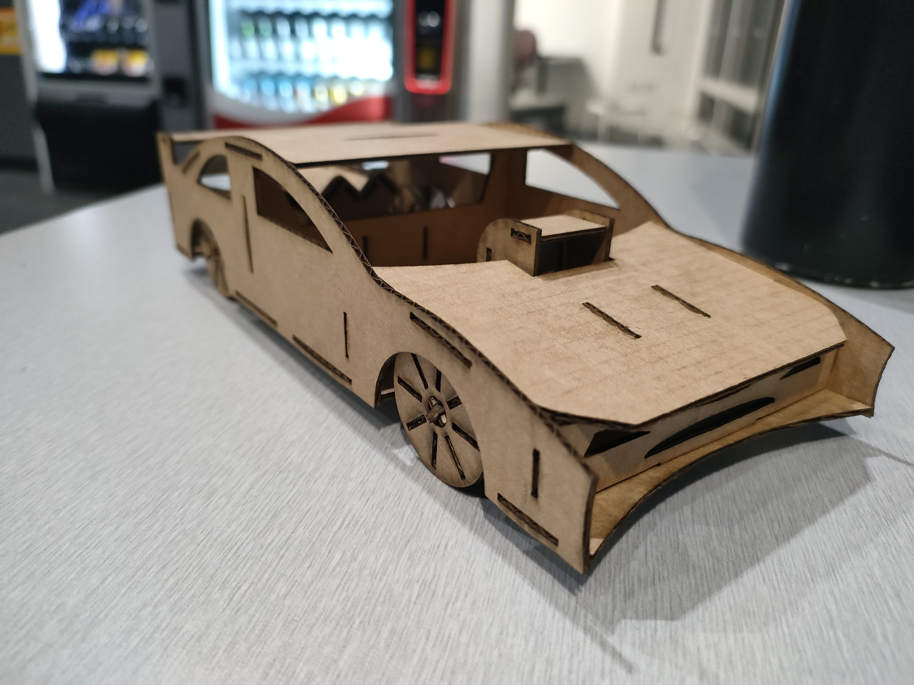

# Laser-Cut Car Project  

This is a **Laser-cut Cardboard Car** that I designed to demonstrate 3D CAD modelling skills and creativity.  
Needed to be cut from one A3 sheet of cardboard and be assembled to be free standing. 
The project succeeded in these objectives.

### Contents  
- [Photos](./Photos/photos.md) - Images of the completed model (click here to see CAD photos aswell)
- [CAD Assemblies](./Model+Cut_Files/assembly(s)/) - CAD assembly files (SolidWorks assembly files)
- [CAD Parts](./Model+Cut_Files/parts/) - CAD part files (SolidWorks part files)
- [Lasercut Files](./Model+Cut_Files/Lasercutting_Flat.DXF) - DXF file to be loaded onto cutter

### Tools Used  
- SolidWorks (CAD design)  
- Laser cutting (fabrication). CO2 laser. Kerf width of aproximatly 0.25mm for 1.3mm card.  

### Preview  
  
